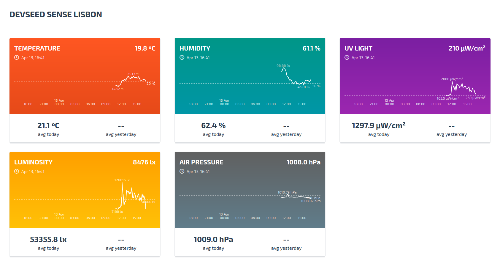

# Devseed Sense

Simple dashboard that taps into the [opensensemap](http://opensensemap.org/) api to show the measurements for a specific [sensebox](www.sensebox.de/en/).



## Development environment
To set up the development environment for this website, you'll need to install the following on your system:

- Node (v4.2.x) & Npm ([nvm](https://github.com/creationix/nvm) usage is advised)

> The versions mentioned are the ones used during development. It could work with newer ones.
  Run `nvm use` to activate the correct version.

After these basic requirements are met, run the following commands in the website's folder:
```
$ npm install
```

### Getting started

```
$ npm run serve
```
Compiles the sass files, javascript, and launches the server making the site available at `http://localhost:1337/`
The system will watch files and execute tasks whenever one of them changes.
The site will automatically refresh since it is bundled with livereload.  
  
The current code will show the values for the [DS Lisbon sensebox](http://opensensemap.org/#/explore/570629b945fd40c8197462fb).  
This can be changed by setting the correct ids in `config/production.js`

### Other commands
Compile the files to the `dist` folder ready for production.
```
$ npm run build
```